## Этапы выполнения:

### Создание облачной инфраструктуры

1. Создайте сервисный аккаунт, который будет в дальнейшем использоваться Terraform для работы с инфраструктурой с необходимыми и достаточными правами. Не стоит использовать права суперпользователя
2. Подготовьте [backend](https://www.terraform.io/docs/language/settings/backends/index.html) для Terraform: 
   б. Альтернативный вариант: S3 bucket в созданном ЯО аккаунте (воспользовался им)
   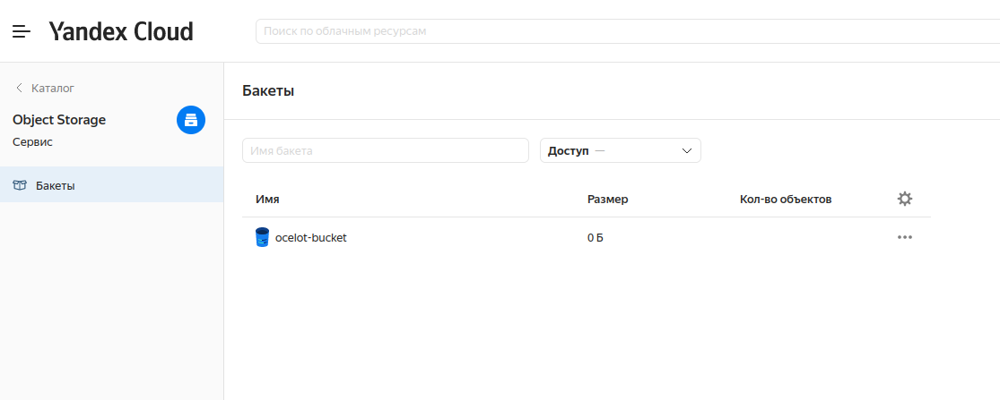
   
3. Настройте [workspaces](https://www.terraform.io/docs/language/state/workspaces.html) 
   а. Рекомендуемый вариант: создайте два workspace: *stage* и *prod*. В случае выбора этого варианта все последующие шаги должны учитывать факт существования нескольких workspace. 
   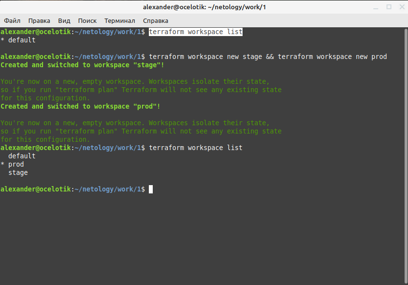
4. Создайте VPC с подсетями в разных зонах доступности.
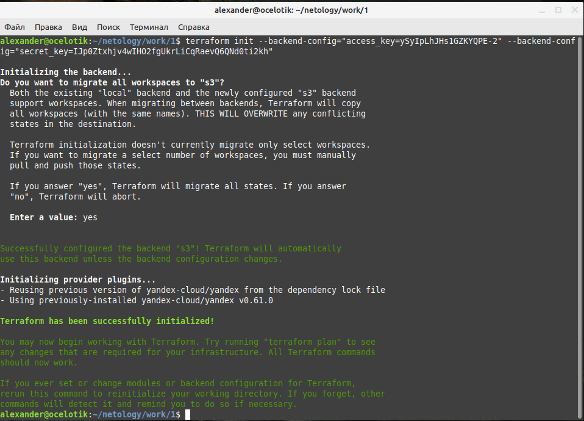
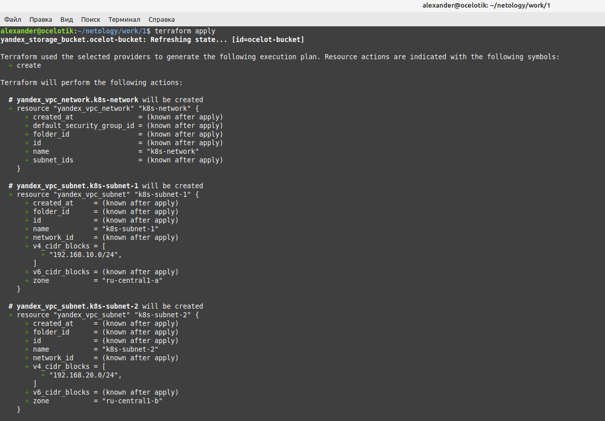
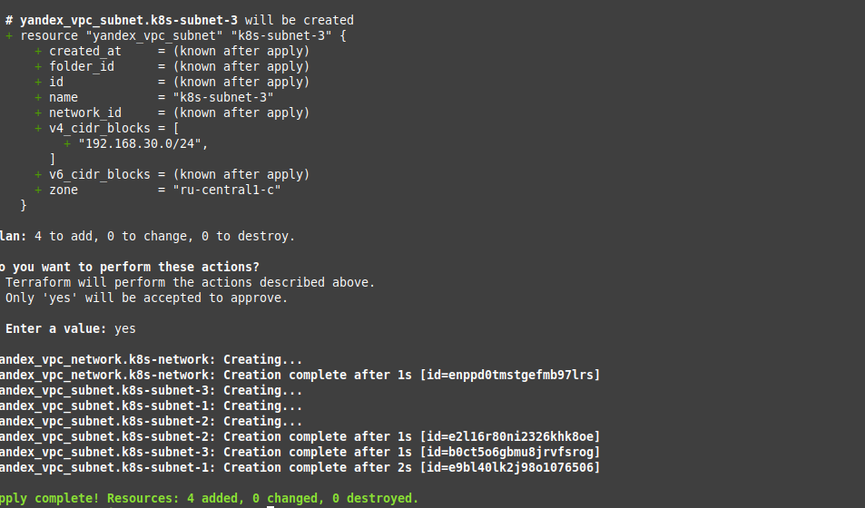
5. Убедитесь, что теперь вы можете выполнить команды `terraform destroy` и `terraform apply` без дополнительных ручных действий.

---
### Создание Kubernetes кластера

На этом этапе необходимо создать [Kubernetes](https://kubernetes.io/ru/docs/concepts/overview/what-is-kubernetes/) кластер на базе предварительно созданной инфраструктуры.   Требуется обеспечить доступ к ресурсам из Интернета.
Это можно сделать двумя способами:
 - Альтернативный вариант: воспользуйтесь сервисом Yandex Managed Service for Kubernetes 
    (во время доработки использовал его, вариант с dynamic kubespray пробовал, но не получилось дать приложению и grafana доступ извне).
    - а. С помощью terraform resource для kubernetes создать региональный мастер kubernetes с размещением нод в разных 3 подсетях
    - б. С помощью terraform resource для kubernetes node group
 - Ожидаемый результат:
 - Работоспособный Kubernetes кластер:
  - Виртуальные машины:
    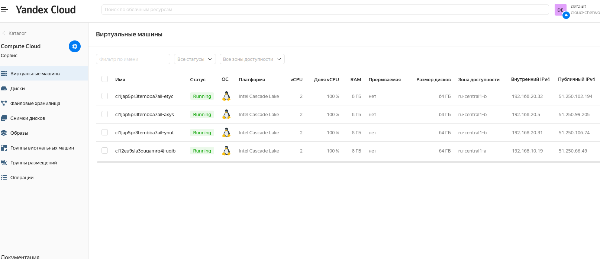
  - Создание ingress контроллера - 
    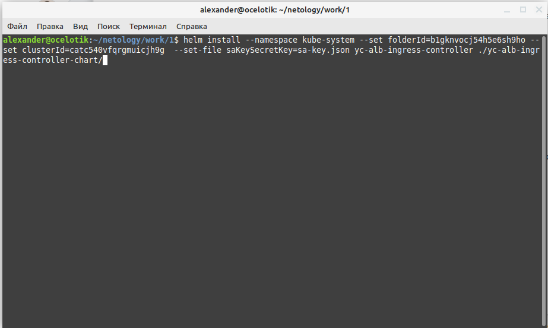
    
    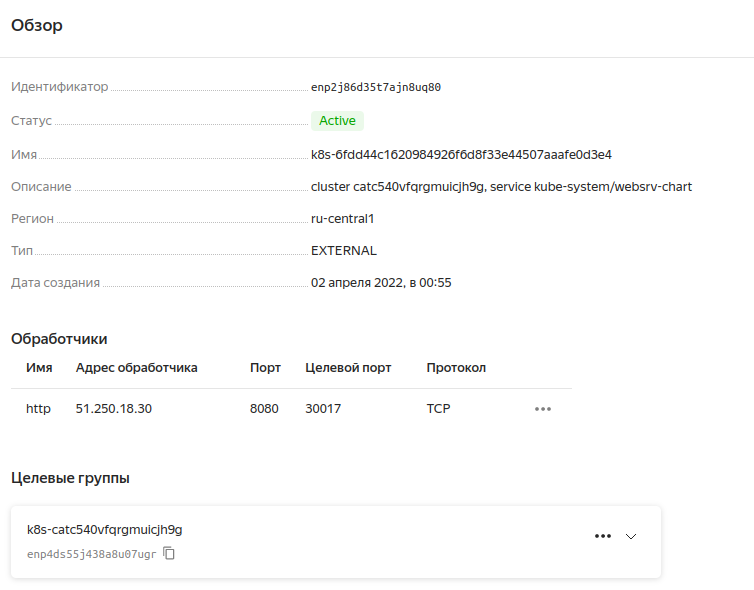
    
В файле ~/.kube/config находятся данные для доступа к кластеру.
    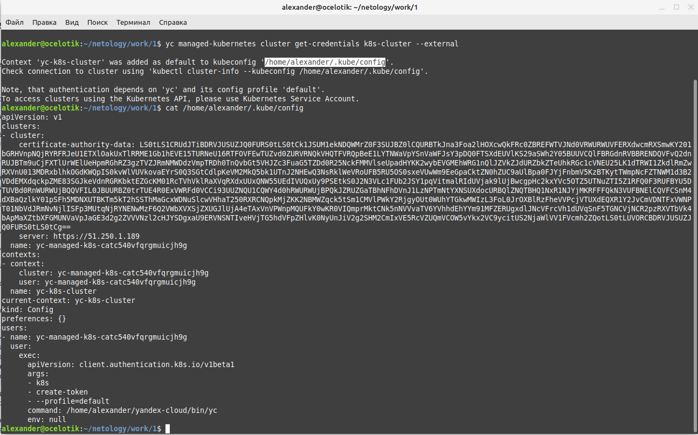
Команда kubectl get pods --all-namespaces отрабатывает без ошибок.
    

---
### Создание тестового приложения

Для перехода к следующему этапу необходимо подготовить тестовое приложение, эмулирующее основное приложение разрабатываемое вашей компанией.

Способ подготовки:

1. Рекомендуемый вариант:
   - а. Создайте отдельный git репозиторий с простым nginx конфигом, который будет отдавать статические данные.
https://github.com/AlexanderSpitsyn07/test-for-dockerfile
   - б. Подготовьте Dockerfile для создания образа приложения.

Ожидаемый результат:
1. Git репозиторий с тестовым приложением и Dockerfile.
https://github.com/AlexanderSpitsyn07/test-for-dockerfile
2. Регистр с собранным docker image. В качестве регистра может быть DockerHub.
 https://hub.docker.com/repository/docker/chehvostik/tarimage

---
### Подготовка cистемы мониторинга и деплой приложения

Уже должны быть готовы конфигурации для автоматического создания облачной инфраструктуры и поднятия Kubernetes кластера. 
Теперь необходимо подготовить конфигурационные файлы для настройки нашего Kubernetes кластера.

Цель:
1. Задеплоить в кластер [prometheus](https://prometheus.io/), [grafana](https://grafana.com/), [alertmanager](https://github.com/prometheus/alertmanager), [экспортер](https://github.com/prometheus/node_exporter) основных метрик Kubernetes.
Альтернативный вариант:
Для организации конфигурации можно использовать [helm charts](https://helm.sh/)
-Установка стека prometheus-grafana:
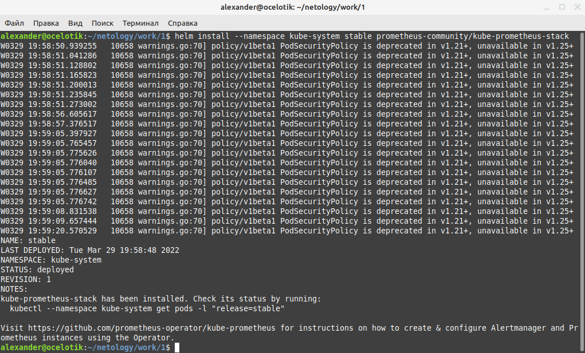

-Веб интерфейс:
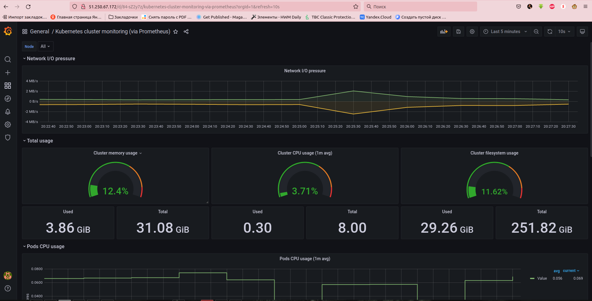

2. Задеплоить тестовое приложение, например, [nginx](https://www.nginx.com/) сервер отдающий статическую страницу.
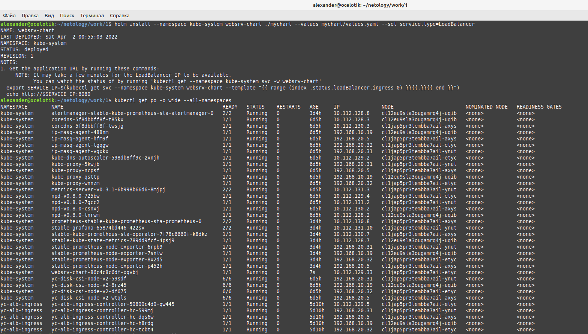
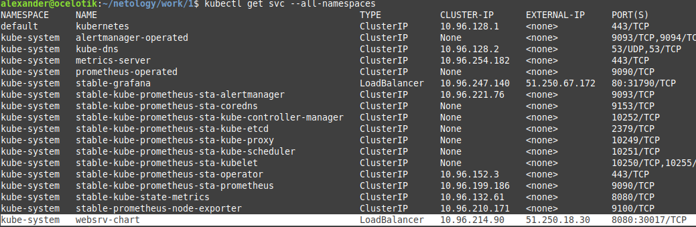

Ожидаемый результат:
1. Git репозиторий с конфигурационными файлами для настройки Kubernetes.
https://github.com/AlexanderSpitsyn07/repoan
2. Http доступ к web интерфейсу grafana.
http://51.250.67.172
UserName: admin
Password: prom-operator
3. Дашборды в grafana отображающие состояние Kubernetes кластера.
В качестве основного Dashboard экспортировал https://grafana.com/grafana/dashboards/315, скриншоты выше.
4. Http доступ к тестовому приложению.
http://51.250.18.30:8080/ и helmchart для него - https://github.com/AlexanderSpitsyn07/diplomchart

---
### Установка и настройка CI/CD

Осталось настроить ci/cd систему для автоматической сборки docker image и деплоя приложения при изменении кода.

Цель:

1. Автоматическая сборка docker образа при коммите в репозиторий с тестовым приложением.
2. Автоматический деплой нового docker образа.

Использовал jenkins.

Ожидаемый результат:

1. Интерфейс ci/cd сервиса доступен по http.
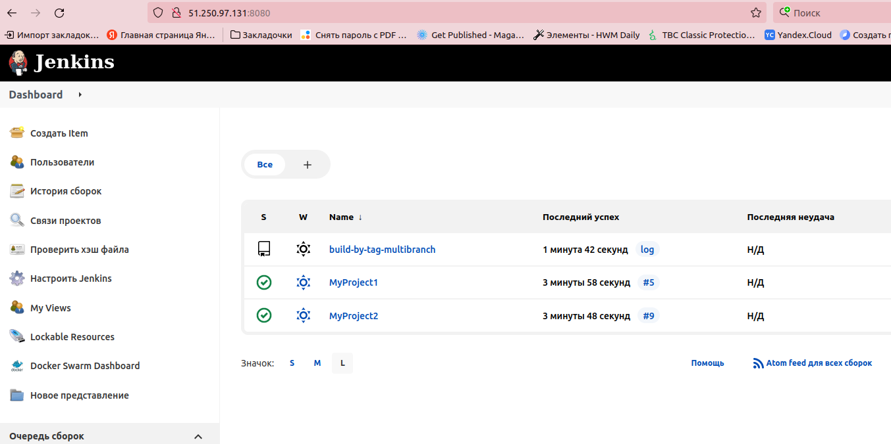
http://51.250.97.131:8080/
admin/AdminAdmin1
2. При любом коммите в репозиторие с тестовым приложением происходит сборка и отправка в регистр Docker образа.
3. При создании тега (например, v1.0.0) происходит сборка и отправка с соответствующим label в регистр, а также деплой соответствующего Docker образа в кластер Kubernetes.

Файл с pipiline в этом же репозитории.
---
## Что необходимо для сдачи задания?

1. Репозиторий с конфигурационными файлами Terraform и готовность продемонстрировать создание всех ресурсов с нуля.
https://github.com/AlexanderSpitsyn07/terr-for-dip
2. Пример pull request с комментариями созданными atlantis'ом или снимки экрана из Terraform Cloud.
3. Репозиторий с конфигурацией ansible, если был выбран способ создания Kubernetes кластера при помощи ansible.
4. Репозиторий с Dockerfile тестового приложения и ссылка на собранный docker image.
https://github.com/AlexanderSpitsyn07/test-for-dockerfile
https://hub.docker.com/repository/docker/chehvostik/tarimage
5. Репозиторий с конфигурацией Kubernetes кластера.
https://github.com/AlexanderSpitsyn07/repoan
6. Ссылка на тестовое приложение - http://51.250.18.30:8080/ - и веб интерфейс Grafana с данными доступа.
http://51.250.67.172
UserName: admin
Password: prom-operator
7. Все репозитории рекомендуется хранить на одном ресурсе (github, gitlab)

